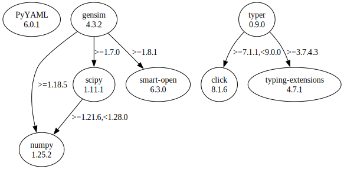

# Third Party Dependencies

<!--[[[fill sbom_sha256()]]]-->
The [SBOM in CycloneDX v1.4 JSON format](https://git.sr.ht/~sthagen/limitys/blob/default/sbom.json) with SHA256 checksum ([3332d17e ...](https://git.sr.ht/~sthagen/limitys/blob/default/sbom.json.sha256 "sha256:3332d17e48d4eb439e1eab0052d99c6e78cc3e696f235817b4955962bcaa51af")).
<!--[[[end]]] (checksum: 4da54f5e611e8ef8134f53d770c6e56f)-->
## Licenses 

JSON files with complete license info of: [direct dependencies](direct-dependency-licenses.json) | [all dependencies](all-dependency-licenses.json)

### Direct Dependencies

<!--[[[fill direct_dependencies_table()]]]-->
| Name                                       | Version                                               | License                 | Author                      | Description (from packaging data)                                       |
|:-------------------------------------------|:------------------------------------------------------|:------------------------|:----------------------------|:------------------------------------------------------------------------|
| [PyYAML](https://pyyaml.org/)              | [6.0](https://pypi.org/project/PyYAML/6.0/)           | MIT License             | Kirill Simonov              | YAML parser and emitter for Python                                      |
| [gensim](http://radimrehurek.com/gensim)   | [4.2.0](https://pypi.org/project/gensim/4.2.0/)       | LGPL-2.1-only           | Radim Rehurek               | Python framework for fast Vector Space Modelling                        |
| [nltk](https://www.nltk.org/)              | [3.7](https://pypi.org/project/nltk/3.7/)             | Apache Software License | NLTK Team                   | Natural Language Toolkit                                                |
| [numpy](https://www.numpy.org)             | [1.24.0](https://pypi.org/project/numpy/1.24.0/)      | BSD License             | Travis E. Oliphant et al.   | Fundamental package for array computing in Python                       |
| [pandas](https://pandas.pydata.org)        | [1.5.2](https://pypi.org/project/pandas/1.5.2/)       | BSD License             | The Pandas Development Team | Powerful data structures for data analysis, time series, and statistics |
| [scikit-learn](http://scikit-learn.org)    | [1.1.2](https://pypi.org/project/scikit-learn/1.1.2/) | BSD License             | Andreas Mueller             | A set of python modules for machine learning and data mining            |
| [typer](https://github.com/tiangolo/typer) | [0.7.0](https://pypi.org/project/typer/0.7.0/)        | MIT License             | Sebastián Ramírez           | Typer, build great CLIs. Easy to code. Based on Python type hints.      |
<!--[[[end]]] (checksum: 24bc52ef379e15db15a76e8ddd5f39f1)-->

### Indirect Dependencies

<!--[[[fill indirect_dependencies_table()]]]-->
| Name                                                     | Version                                                  | License                                           | Author                                    | Description (from packaging data)                                                                                                                  |
|:---------------------------------------------------------|:---------------------------------------------------------|:--------------------------------------------------|:------------------------------------------|:---------------------------------------------------------------------------------------------------------------------------------------------------|
| [click](https://palletsprojects.com/p/click/)            | [8.1.3](https://pypi.org/project/click/8.1.3/)           | BSD License                                       | Armin Ronacher                            | Composable command line interface toolkit                                                                                                          |
| [joblib](https://joblib.readthedocs.io)                  | [1.2.0](https://pypi.org/project/joblib/1.2.0/)          | BSD License                                       | Gael Varoquaux                            | Lightweight pipelining with Python functions                                                                                                       |
| [python-dateutil](https://github.com/dateutil/dateutil)  | [2.8.2](https://pypi.org/project/python-dateutil/2.8.2/) | Apache Software License; BSD License              | Gustavo Niemeyer                          | Extensions to the standard Python datetime module                                                                                                  |
| [pytz](http://pythonhosted.org/pytz)                     | [2022.7](https://pypi.org/project/pytz/2022.7/)          | MIT License                                       | Stuart Bishop                             | World timezone definitions, modern and historical                                                                                                  |
| [regex](https://github.com/mrabarnett/mrab-regex)        | [2022.10.31](https://pypi.org/project/regex/2022.10.31/) | Apache Software License                           | Matthew Barnett                           | Alternative regular expression module, to replace re.                                                                                              |
| [scipy](https://scipy.org/)                              | [1.9.3](https://pypi.org/project/scipy/1.9.3/)           | BSD License                                       | "SciPy Developers" <scipy-dev@python.org> | Fundamental algorithms for scientific computing in Python                                                                                          |
| [six](https://github.com/benjaminp/six)                  | [1.16.0](https://pypi.org/project/six/1.16.0/)           | MIT License                                       | Benjamin Peterson                         | Python 2 and 3 compatibility utilities                                                                                                             |
| [smart-open](https://github.com/piskvorky/smart_open)    | [6.3.0](https://pypi.org/project/smart-open/6.3.0/)      | MIT License                                       | Radim Rehurek                             | Utils for streaming large files (S3, HDFS, GCS, Azure Blob Storage, gzip, bz2...)                                                                  |
| [threadpoolctl](https://github.com/joblib/threadpoolctl) | [3.1.0](https://pypi.org/project/threadpoolctl/3.1.0/)   | BSD License                                       | Thomas Moreau                             | Python helpers to limit the number of threads used in native libraries that handle their own internal threadpool (BLAS and OpenMP implementations) |
| [tqdm](https://tqdm.github.io)                           | [4.64.1](https://pypi.org/project/tqdm/4.64.1/)          | MIT License; Mozilla Public License 2.0 (MPL 2.0) | "tqdm developers" <python.tqdm@gmail.com> | Fast, Extensible Progress Meter                                                                                                                    |
<!--[[[end]]] (checksum: 6845d7ccd5964e9f2ce663ced4b4dde4)-->

## Dependency Tree(s)

JSON file with the complete package dependency tree info of: [the full dependency tree](package-dependency-tree.json)

### Rendered SVG

Base graphviz file in dot format: [Trees of the direct dependencies](package-dependency-tree.dot.txt)



### Console Representation

<!--[[[fill dependency_tree_console_text()]]]-->
````console
gensim==4.2.0
  - numpy [required: >=1.17.0, installed: 1.24.0]
  - scipy [required: >=0.18.1, installed: 1.9.3]
    - numpy [required: >=1.18.5,<1.26.0, installed: 1.24.0]
  - smart-open [required: >=1.8.1, installed: 6.3.0]
nltk==3.7
  - click [required: Any, installed: 8.1.3]
  - joblib [required: Any, installed: 1.2.0]
  - regex [required: >=2021.8.3, installed: 2022.10.31]
  - tqdm [required: Any, installed: 4.64.1]
pandas==1.5.2
  - numpy [required: >=1.21.0, installed: 1.24.0]
  - python-dateutil [required: >=2.8.1, installed: 2.8.2]
    - six [required: >=1.5, installed: 1.16.0]
  - pytz [required: >=2020.1, installed: 2022.7]
PyYAML==6.0
scikit-learn==1.1.2
  - joblib [required: >=1.0.0, installed: 1.2.0]
  - numpy [required: >=1.17.3, installed: 1.24.0]
  - scipy [required: >=1.3.2, installed: 1.9.3]
    - numpy [required: >=1.18.5,<1.26.0, installed: 1.24.0]
  - threadpoolctl [required: >=2.0.0, installed: 3.1.0]
typer==0.7.0
  - click [required: >=7.1.1,<9.0.0, installed: 8.1.3]
````
<!--[[[end]]] (checksum: 6c48f8b234a9548ea962a0f7d568d111)-->
